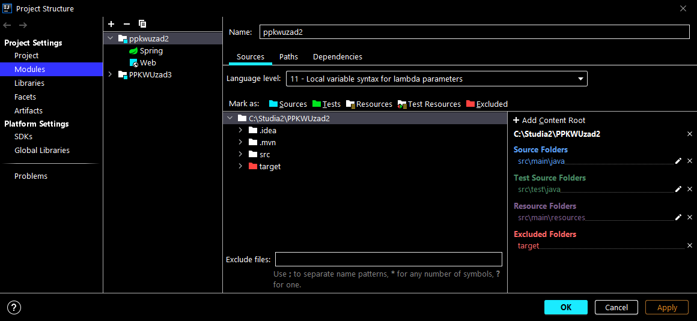

# PPKWUzad3
PPKWU

Zadanie 3 API

Do tego projektu dodany został moduł z zadania 2 wykorzystujący api do tworzenia statystyk stringów stringów.

Dodaje się go w intelij klikając File > Project Structure > Project Settings > Modules.

Klikając + w drugiej kolumnie u góry dodajemy moduł z projektem zadania 2.

