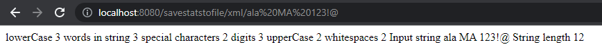
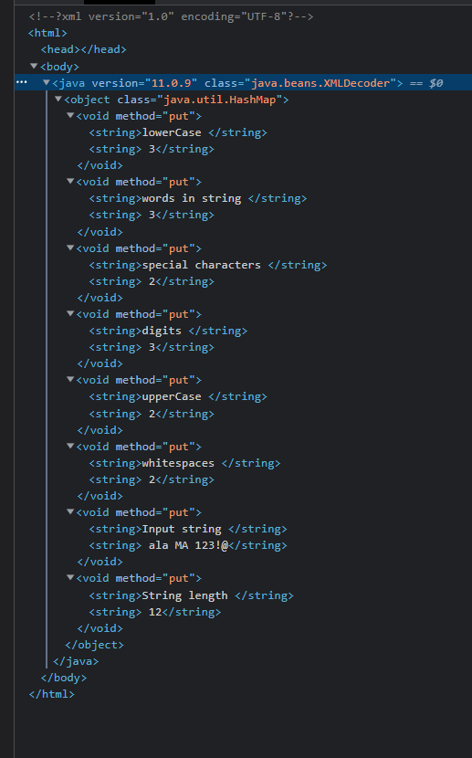

#PPKWU Zadanie 3 API

Do tego projektu dodany został moduł z zadania 2 wykorzystujący api do tworzenia statystyk stringów stringów.

Dodaje się go w intelij klikając File > Project Structure > Project Settings > Modules.

Klikając + w drugiej kolumnie u góry dodajemy moduł z projektem zadania 2.

Aplikacja domyślnie uruchamiana jest na porcie 8080 pod adresem `http://localhost:8080/'

Projekt składa sie z kontrolera FileSaverApiController, który zawiera metodę restową GET saveStatsToFile zwracającą stringa w postaci jednego z 4 formatów plików (txt, json, xml, csv).
Zapytanie ma formę 'savestatstofile/typ/string', 'typ' to do wyboru txt, json, xml , csv. Podanie innego typu zwróci komunikat 'File type must be txt, json, xml or csv.'

Przykładowe użycie:

'http://localhost:8080/savestatstofile/xml/ala MA 123!@'

Po zbadaniu źródła strony:

Dodatkowo w projekcie występuje klasa StringResultToMap z metodą stringToMap do konwertowania stringa wejściowego na mape.